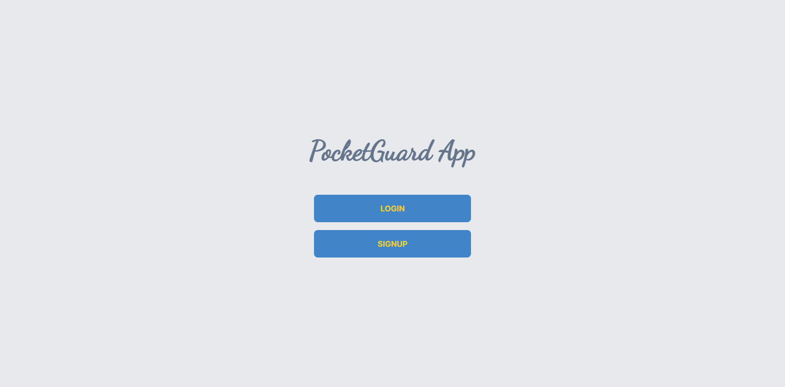
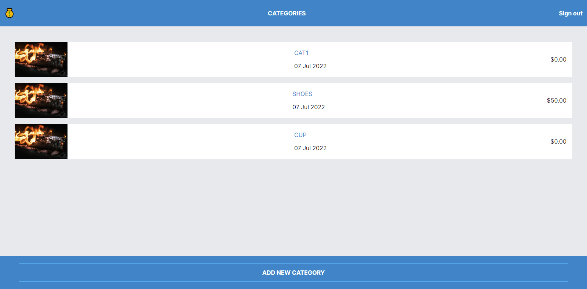
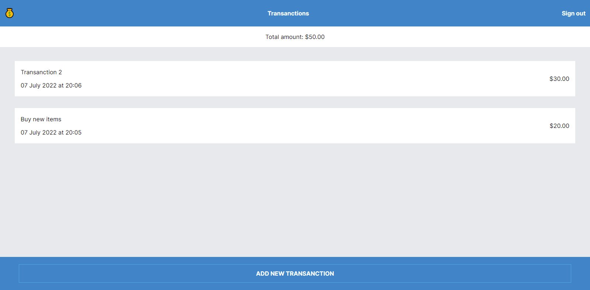

# PocketGuard

> PocketGuard is a mobile web application that assists users with money management. It may also show consumers a list of transactions they've done that are tied to their categories, as well as the overall amount of money they've spent.

## Screenshots

### Splash Screen

### Categories page (Home page)

### Transanctions page

## Built With

- Ruby
- Ruby on rails
- TailwindCSS

## Live Demo

[Live Demo Link](https://budget-app-shop.herokuapp.com)

## Video Link

[VIDEO LINK](https://youtu.be/oBZIBtbFxYQ)

## Getting Started

**To get local copy up and running the application follow these simple steps:**

### Prerequisites

You need the following tools be installed in your computer:

- Git
- Ruby
- Rails

### Setup

1. Download the Zip file or clone the repo with:

   `git clone https://github.com/cynthiainga/Budget_App.git`

2. To access the project directory
   `cd Budget_App`

### Install

`bundle install`
`rails db:migrate`

### To run the app locally in the browser use:

`rails s`

### Run tests

To run tests:

- `bundle exec rspec` or
- `rspec`

### Deployment

To deploy to Heroku:

- `heroku create`
- `git push heroku master`
- `heroku open`

## Authors

👤 **Mwafrika Josué**

- GitHub: [@mwafrika](https://github.com/mwafrika)
- Twitter: [@mwafrika](https://twitter.com/mwafrikamufung1)
- LinkedIn: [@mwafrika](https://linkedin.com/in/mwafrika-mufungizi)

## 🤝 Contributing

Contributions, issues, and feature requests are welcome!

Feel free to check the [issues page](https://github.com/mwafrika/budget-app/issues).

## Show your support

Give a ⭐️ if you like this project!

## Acknowledgments

- Hat tip to anyone whose code was used
- Inspiration
- etc

## 📝 License

This project is [MIT](./MIT.md) licensed.
